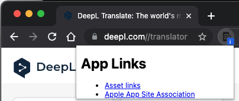

# app-link-checker

Checks if the current domain has an assetlinks.json or apple-app-site-association file.
And, displays links to asset files on popup.

I am a JS newbie and my code is terrible. (My English is also terrible. lol)
PR is welcome in all of this repo.
(If there is demand, I would eventually like to distribute it in the Chrome Store.)

If there is anyone who can perform maintenance, add features, and distribute it in the store, I am willing to transfer the repository.

## demo

## (FYI)

- Android App Links - <https://developer.android.com/training/app-links/>
- iOS / Apple Universal Links - <https://developer.apple.com/documentation/xcode/supporting-associated-domains>

## LICENSE

TBD
(It will probably be under the MIT license.)
